# Reentry Mission Operations Control Room

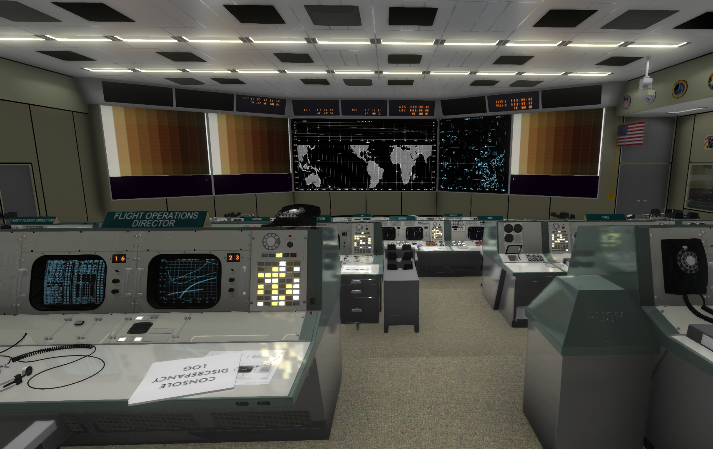

Manual version 0.8607.0-git (for MOCR / "MOCRL" version 0.94)

This manual isn't necessarily realistic, and is not crew-rated.

[PDF-version](https://github.com/sundhaug92/mocr-manual/raw/master/readme.pdf)

This manual assumes you have already read the MCC-manual

## Controls

## Voice chat

MOCR has built in support for voice-chat. Voice-chat is not enabled by default at the moment, but is enabled by pressing the 🔊-icon in the upper right of the intercom .

When you do this, a few things will come up:

1. In the lower right, you'll see a button marked **VOICE CONNECT**. If you want to hear from or speak to the other players in the session, you need to click this. If the button is marked "Voice Disconnect", you're already set for the next step.

2. InGame settings. Here you need to click **Transmit**. Secondly, if you don't want to use Push To Talk (PTT), you need to select VoiceDetection. Note that VoiceDetection might not be enabled in the current build.

You should now be setup for receiving, and optionally transmitting voice.

Now for the next step: Who do you want to listen to, and who do you want to talk to. In order to select this, you need to find a console. The quickest way to do this, is to use the view-selector. If you can't see the View-selector on the left of your screen, press V. Make sure to select a console that's not already crewed.

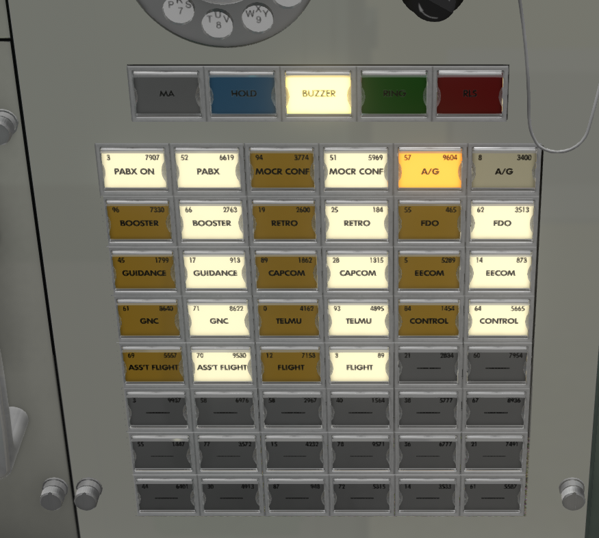

The exact layout of the voice-setup buttons varies by console, but the generally setup is the same. The **yellow** buttons indicate what you're listening to. A lit indicator indicates that you're listening to that loop. Additionally, make sure that PABX and PABX ON are both lit. In the above example, I'm only listening to the A/G loop (Air / Ground). The **white** buttons are used to select which loop you talk into, when you talk. A blinking white indicator indicates that a given loop is selected for speaking into.

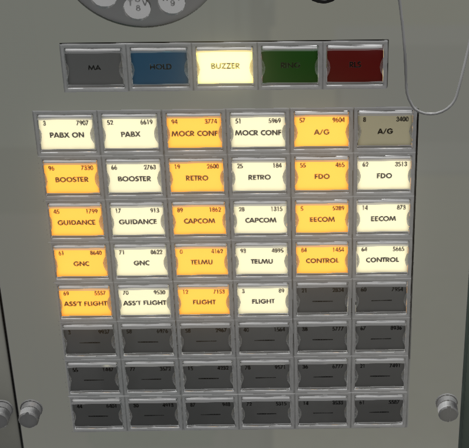

In the above example you I've chosen to listen to all loops, and speaking to the A/G loop.

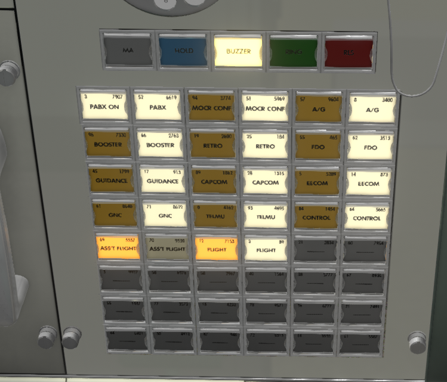

In the above example on the other hand, I've chosen to only listen to the assistant flight director and the flight director loops, and to speak on the assistant flight loop.

## Views

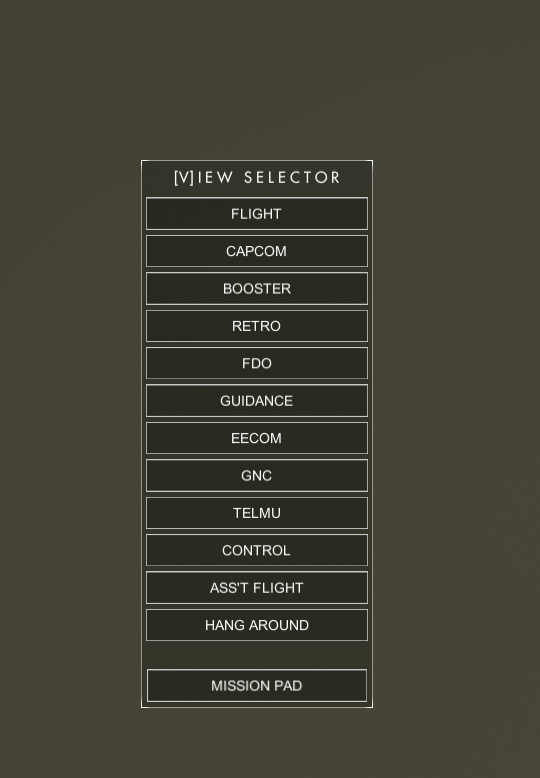

Console description can be found at: [HERE](https://arstechnica.com/science/2019/12/apollo-flight-controller-101-every-console-explained/)

See also:

- [NASA: This Is Mission Control - 1970 - CharlieDeanArchives / Archival Footage](https://www.youtube.com/watch?v=vK2aWnSR4sg)

### CAPCOM

### FAO

### PAO

### BOOSTER

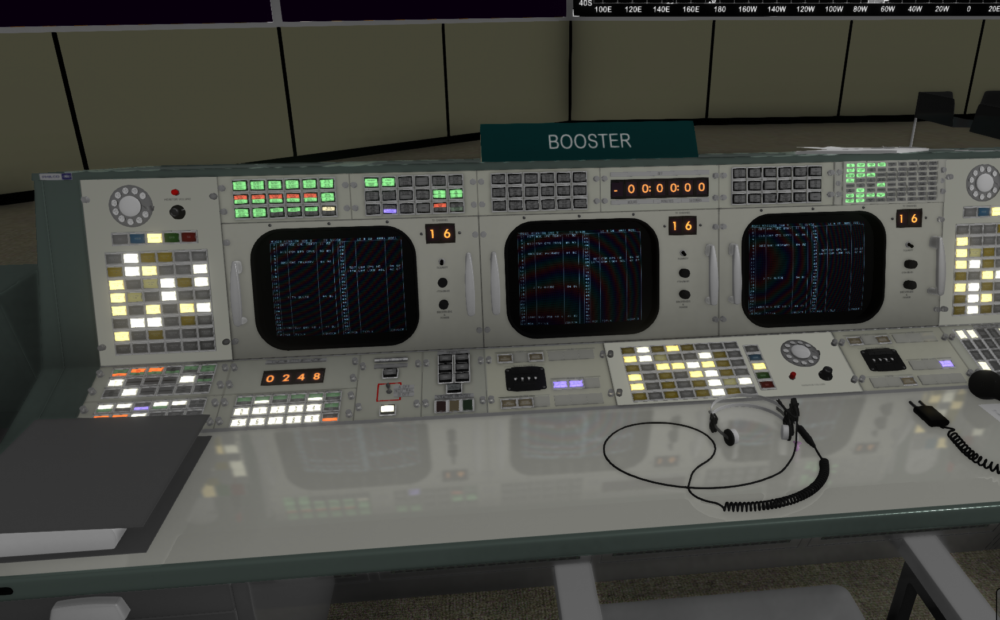
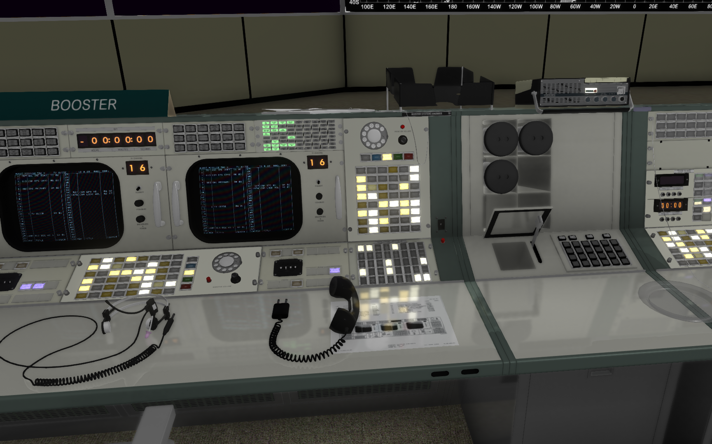

Booster is responsible for monitoring the Saturn up to and including LV separation.
Booster has three screens to keep a track of everything. Left and center is controlled through one set of dials, right is controlled through a second set.

### RETRO

### FDO

### GUIDANCE

### Flight Director

The flight director role is mostly the same as in Mercury. This includes holding or proceeding the count.

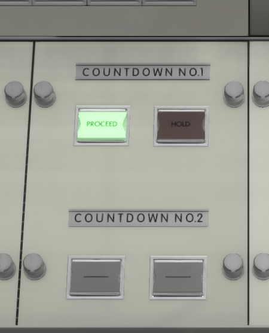
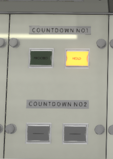

### Assistant Flight Director

The assistant flight director role, is as the name implies to assist the flight director. In addition, they have the responsibility of selecting what should be shown on the . This is done in a similar way to selecting content for the small screens (See [Screens](#screens)), with the addition of a few buttons to select the projectors. Note that the main projector screen uses 4 digit channels rather than 2 digit ones, and cannot display any two digit channel.

#### Main room display screens

The screens at the front of the room are generally set to reflect the current mission task in the short term. Screens may be put up on request, but a good AFD should have a "set" of screens ready to go depending on current objectives. A few example mission tasks and their matching screen sets are provided below.

- CSM systems check
  - A generic default state to keep an eye on CSM systems. Though also especially useful for the following mission stages/tasks:
    - Pre Launch
    - Post Insertion
    - Periodic Systems Checks (in coordination with the ASTRO)
  - Left: Channel 3 ([CSM EPS CRYO](#03-csm-eps-cryo))
  - Left Center: Channel 34 ([CSM EPS HD](#34-csm-eps-hd))
  - Right: Channel 6 ([GNC Primary](#06-gnc-primary))
- Boost (T-25 to Insertion)
  - From T-25 (from liftoff) to Earth Parking Orbit Insertion. Allows the entire MOCR to keep an eye on key pages during boost for issues, including the current state of the SIVb and orbital data, helping visualize the current state of the CSM without sacrificing local station screen real estate.
  - Left: Channel 25 ([SLV BSE NO 1](#25-slv-bse-no-1))
  - Left Center: Channel 4 ([VEH ACC](#04-veh-acc))
  - Right: Channel 7 ([FDO CSM ORB](#07-fdo-csm-orbital))
- TLI
  - From post insertion checks complete to SVIb Shutoff, similar to boost but trades out the now useless VEH ACC page for the CSM's burn alignment to ensure the TLI burn remains on target.
  - Left: Channel 25 ([SLV BSE NO 1](#25-slv-bse-no-1))
  - Left Center: Channel 35 ([CSM look AGL](#35-csm-look-agl))
  - Right: Channel 6 ([GNC Primary](#06-gnc-primary))
- SPS Burn
  - For any kind of corrective Guido calculated maneuver involving the CSM primary engine, Note the SPS Burn Mon Page does NOT work with the SVIb during TLI
  - Left: Channel 14  ([SPS Burn Mon](#14-sps-burn-mon))
  - Left Center: Channel 35  ([CSM look AGL](#35-csm-look-agl))
  - Right: Channel 7 ([FDO CSM ORB](#07-fdo-csm-orbital))
    - Alternate: Channel 6 ([GNC Primary](#06-gnc-primary))
      - When FDO CSM Orb isn't providing useful data

#### AFD Clock

The AFD also controls a 60 minute clock visible both from their local desk and as part of the timing section of the display and projection wall. This can be used to give timing reference to multiple stations, especially counting up for burn timers. The clock displays in MM:SS format and will loop from 59:59 to 00:00 and vice versa.

## Projector and Timing Wall

The front of the MOCR contains a series of projector screens and alpha numerical displays designed to help with coordination across all stations.

### Timing Displays

The top row of the wall consists of nine alphanumeric display panels which display information regarding the timing of various mission stages for easy reference anywhere in the room. Though currently only five of the timing displays are operational in Reentry.

- Left set
  - Left: INOP
  - Center: INOP
  - Right: Current Greenwich Mean Time (GMT)
- Central Set
  - Left: Ground Elapsed Time (GET): Time from liftoff as observed from earth.
  - Center: TB#: A set of timing clocks as part of the IU package aboard the Saturn V. Controlled various automated functions during Boost and TLI. The currently active clock is repeated here for reference by mission controllers, along with its clock number (1-8).
    - TB Clocks:
      - TB 1 Liftoff (LO)
      - TB 2 S-IC center engine cutoff (CECO)
      - TB 3 S-IC outboard engine cutoff(OECO)
      - TB 4 S-II culoff
      - TB 5 S-IVB cutoff(end boost phase)
      - TB 6 S-IVB restart preparations & second bum
      - TB 7 S-IVB cutoff
      - TB 8 S-IVB propellant dump sequence
  - Right: (INOP) Computed signal loss window as the spacecraft transits behind the moon
    - (INOP) Aquisition Of Signal (AOS): Expected time of telemetry pickup after far side moon transit
    - (INOP) Loss Of Signal (LOS): Expected time of telemetry drop preceding next far side moon transit
- Right set
  - Left: RTCC computed burn times for TLI/SPS
    - Time of IGnition: Computed GET time for next RTCC burn
    - Countdown: Time till ignition of next RTCC burn
  - Center: INOP
  - Right: AFD Timer: AFD controlled clock used for coordinating various stations or roomwide reference. As its controlled by the AFD and usually set at the request of either a controller or the flight director, its purpose can change over the course of the mission and is usually state and objective dependent.

### Projector Screens

The lower row of the front wall contains five screens for mission telemetry and data, dominated by the absolutely massive main projector screen in the center.
Three of the screens can be set to mirror any screen availiable to the regular control stations. While the main projector screen can be set to show the current orbital position of the spacecraft in reference to Earth, the Moon, or the transit between the two. The aux projector screen is currently INOP in Reentry and displays a static image of landing sites. The screens from left to right are the Left Projector TV, Center Left Projector TV, Main Projector Screen, Aux Projector Screen, and Right Projector TV.

These screens are set at the discretion of the AFD, either on the AFD's own schedule or upon request by a controller. All four of the operational screens MUST be set manually, there is no automated screen switching system for any stage of the mission.

## Screens

Each console has a number of 14" screens. With these you can look at a number of channels with various data. One way of selecting the data to be shown is to use TV-mode.

To select a TV-mode channel:

1. Press TV mode
2. Select the channel with the appropriate input selector, depending on which screen you want to put it on. If you're unsure of which channel you want, select [TV-guide (channel XX)](#16-tv-guide).
3. Now one or more buttons should light up, depending on how many screens controlled by that input selector. Press the relevant screen by pushing selecting it under "ENTER".

Information from each screen can be "Hardcopied" to %UserProfile%\AppData\LocalLow\Wilhelmsen Studios\ReEntry\Export\MOCR as a PNG, which can then be shared on discord or any other site as required.

### TV channels

#### (01) CMC DSKY AND STATE BUFF MON (AGC CMC DSKY)

This screen shows the CMC DSKY (CSM AGC DSKY), and various AGC state.

#### (03) (CSM EPS CRYO)

#### (04) (VEH ACC)

#### (06) CSM GNC PRIMARY TAB (GNC PRIMARY)

#### (07) (FDO CSM ORB)

#### (12) (CSM RCS STUS)

#### (14) (SPS BURN MON)

#### (16) TV GUIDE

This channel shows you a listing of what's on each channel. This listing is split in two, with three columns each showing the channel number, a description, and an identifier.

#### (25) SLV BSE NO 1

#### (27) (LM DSKY)

This is the LM-equivalent of [AGC CMC DSKY (channel 01)](#01-cmc-dsky-and-state-buff-mon-agc-cmc-dsky)

#### (28) (LM EECOM)

#### (34) (CSM EPS HD)

#### (35) (CSM LOOK AGL)

#### (36) (LM ECS)

#### (37) (LM LOOK AGL)

#### (39) (FDO LM ORB)

#### (44) (LM ELECT/INST)

#### (45) (LM GUID CONT)

#### (47) (LM AGS)

#### (48) (LM DES/ASC)

#### (90) RTCC

See section [RTCC](#rtcc)

#### (1111) Earth map

Used on main screen to show the Earth orbital position map and the Earth-Moon-Earth transit position (Transit info currently INOP)

#### (2222) Lunar map

Used on main screen to show the Lunar map and AGL

## RTCC

NASAs Real-Time Computing Complex, which resides at the first floor of building 30, the same building that houses MOCR 1 and 2, houses 5 IBM 360/75 computers, of which at any time 2 are used redundantly (1 active, 1 hotswap) to support the flight, while the others are used for sims, experiments, etc, and can be swapped in to replace one of the two flight support computers. Data from the RTCC is primarily fed into the display control system, including the television slide display, which is responsible for controlling the overlays used in the above-mentioned TV-system.

To access RTCC programs, you must first:

1. Be in a console that supports RTCC data. This includes [BOOSTER](#booster) and [GUIDANCE](#guidance)
2. Select the [RTCC TV-channel (channel 90)](#90-rtcc)
3. Press the LOAD/INITIATE button (upper half)
4. Using the keyboard below it, enter the four-digit load-line for the program you want to access (XXXX for program guide)
5. Now press the INITIATE part of the previously mentioned button
6. It should now show the selected load-number.

To input a line of data, do the same thing, but with LINE/INITIATE instead

In the case of GUIDANCE you use the left keyboard to input load-numbers and to input a line, and the right keyboard for DSKY inputs.
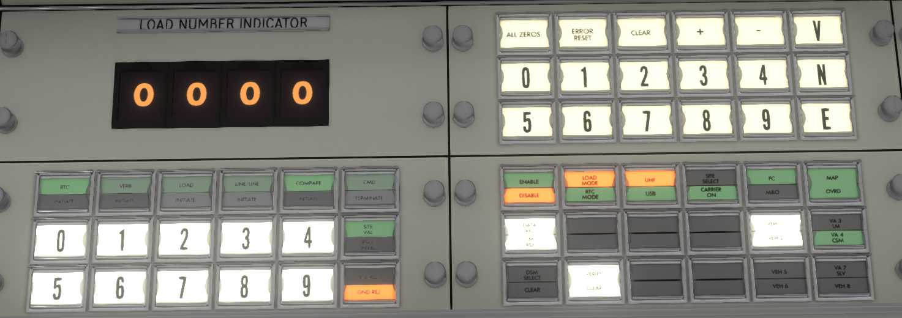

### RTCC program guide

#### Program guide

##### DSKY

#### SPS burn program

## Room settings

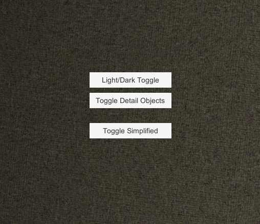

This menu-options lets you switch between light/dark, toggle detail-objects, and toggle the simplified view, all of whom may increase your performance

## Other

IDRK where to put it, but there's a clock some where that can count up or down, and prob take the number from somewhere IDK

Also, troublemakers are a thing, basically the same as before (though now a real-life trouble-maker can do annoying things on voice).
